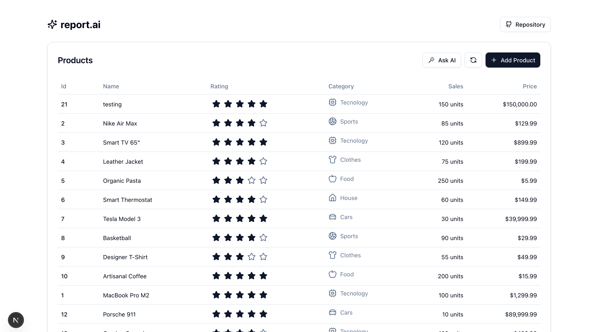

# ✨ report.ai



## 🚀 About
An intelligent chat application that generates reports and insights from a PostgreSQL database using Vercel AI SDK.

## 🛠 Technologies Used


## 📦 Installation & Setup

Follow these steps to set up the project on your local machine:

### 1️⃣ Clone the repository
```bash
git clone https://github.com/arthurmousinho/report.ai.git
cd report.ai
```

### 2️⃣ Backend (API) Setup
Navigate to the `api` folder and install dependencies:
```bash
cd api
npm install
```

Copy environment variables:
```bash
cp .env.example .env
```
**⚠️ Important:** Set your `OPENAI_API_KEY` in the `.env` file before proceeding.

Run database using Docker:
```bash
docker compose up -d
```

Run database migrations:
```bash
npm run migrate
```

Seed the database with initial data:
```bash
npm run seed
```

Start the backend server:
```bash
npm run dev
```

### 3️⃣ Frontend (Web) Setup
Navigate to the `web` folder and install dependencies:
```bash
cd ../web
npm install
```

Copy environment variables:
```bash
cp .env.example .env
```

Start the frontend server:
```bash
npm run dev
```

## 🎯 Usage
Once both the API and the frontend are running, you can open the application in your browser and start generating reports with **AI-powered filtering**.

- The backend runs at `http://localhost:3333` (or as configured in `.env`)
- The frontend runs at `http://localhost:3000`